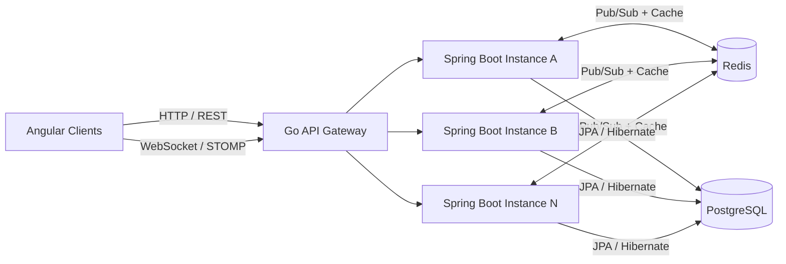
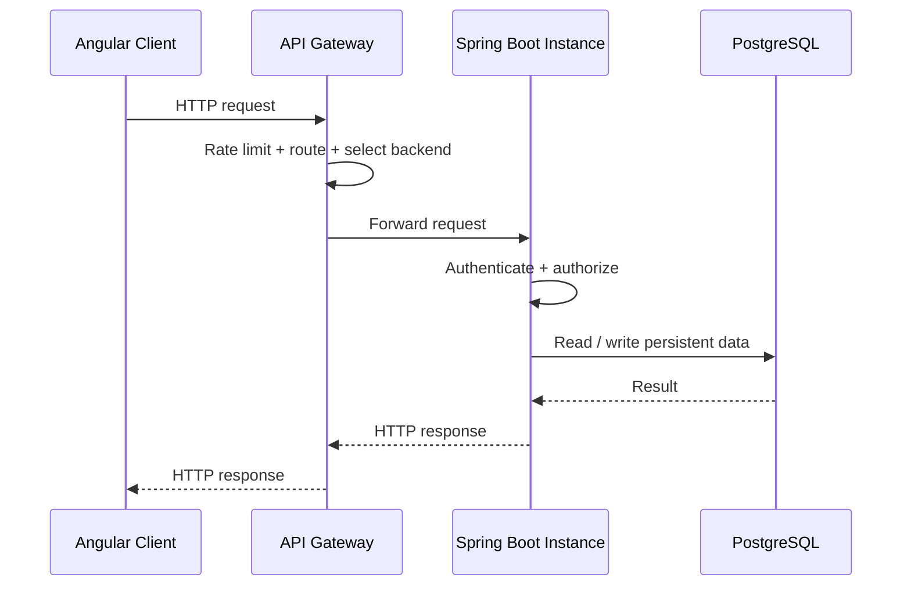
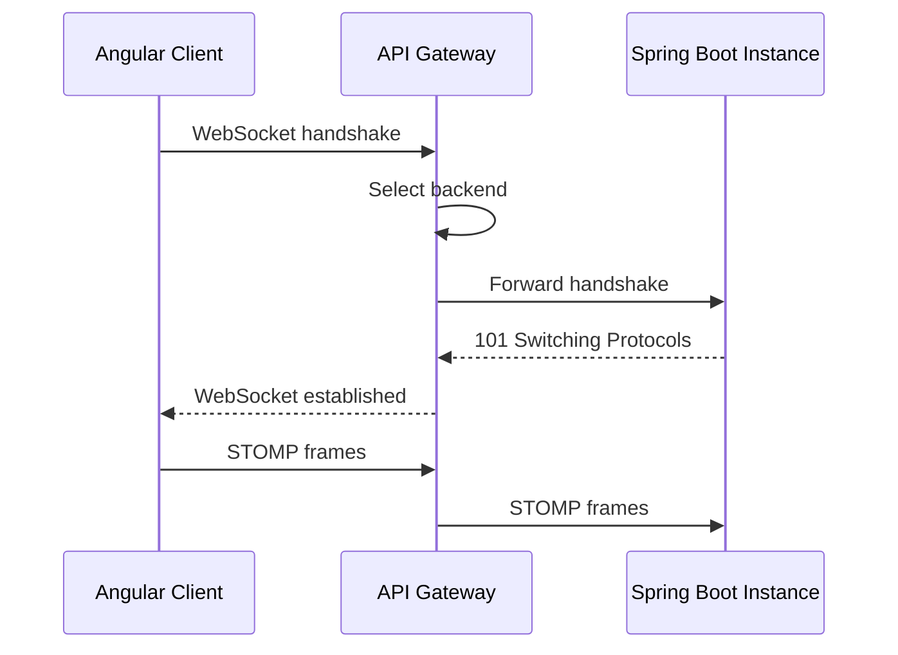
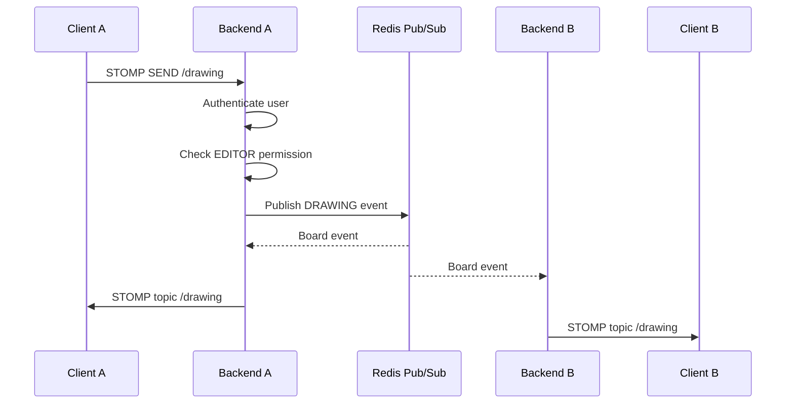

# Architecture

## 1. Overview

The Collaborative Whiteboard uses a layered client-server architecture with a dedicated API Gateway, multiple Spring Boot backend instances, Redis, and PostgreSQL.

The central architectural goal is to support real-time collaboration while allowing the backend application to scale beyond a single server instance.



## 2. Components

### Angular Client

The frontend provides the whiteboard UI and canvas-based rendering. It communicates with the backend through REST APIs for persistent application operations and STOMP over WebSockets for realtime collaboration.

The collaboration client maintains transient remote state such as remote cursors and active drawing/transform operations without treating that state as persistent database data.

### Go API Gateway

The API Gateway is the entry point for application traffic.

Its responsibilities include:

- Route matching
- Rate limiting
- Load balancing across backend instances
- Health-aware backend selection
- Reverse proxying
- WebSocket proxying
- Request logging

The gateway periodically checks backend health and avoids unhealthy instances during load balancing.

A WebSocket is selected onto a backend instance during connection establishment. Once the connection has been upgraded, subsequent STOMP frames travel through that existing connection to the selected backend instance.

### Spring Boot Backend

The backend contains the application's business logic and exposes both REST and WebSocket/STOMP endpoints.

Each instance contains the same application components:

```text
Spring Boot
├── REST API
├── WebSocket / STOMP
├── Collaboration Controllers
├── Application / Business Services
├── Authorization Policies
└── Persistence Layer
```

The application is designed so that multiple instances can process requests concurrently.

### Redis

Redis is used as the distributed coordination layer for realtime collaboration.

#### Pub/Sub

Each board has a board-specific event channel:

```text
board:{boardId}:events
```

A backend publishes a collaboration event to Redis. All subscribed backend instances receive the event and forward it to their locally connected WebSocket sessions.

#### Permission Cache

Board permissions can also be cached in Redis for the realtime authorization path. The cache prevents frequent database permission lookups for high-frequency WebSocket traffic such as cursor movement.

### PostgreSQL

PostgreSQL stores persistent state, including:

- Users
- Boards
- Board memberships
- Invitations
- Whiteboard elements

JPA/Hibernate is used for persistence, while Flyway manages database migrations.

## 3. Request Flow

### REST request



### WebSocket connection



## 4. Distributed Realtime Event Flow

The important distinction is that a WebSocket session is local to one backend instance, while Redis distributes the board event across the cluster.



This allows clients connected to different backend instances to participate in the same board session.

## 5. Board Event Envelope

Redis events are wrapped in a board event envelope:

```java
public record RedisBoardEvent(
    String type,
    UUID boardId,
    Object payload
) {}
```

The event type identifies the category of realtime event while `payload` contains the operation-specific data.

Examples include:

```text
CURSOR_MOVED
CURSOR_LEFT
DRAWING
ELEMENT_CREATED
ELEMENT_UPDATED
ELEMENT_DELETED
```

## 6. Collaboration Channels

### Cursor

```text
SEND:
/app/boards/{boardId}/cursor

SUBSCRIBE:
/topic/boards/{boardId}/cursor
/topic/boards/{boardId}/cursor-left
```

Cursor movement is transient and is rate-limited/throttled on the client to avoid generating unnecessary traffic.

### Drawing

```text
SEND:
/app/boards/{boardId}/drawing

SUBSCRIBE:
/topic/boards/{boardId}/drawing
```

Drawing events represent transient collaborative operations such as `START`, `UPDATE`, and `END`.

### Elements

```text
SEND:
/app/boards/{boardId}/elements/create

SUBSCRIBE:
/topic/boards/{boardId}/elements
```

Persistent element changes are handled by the application service and then broadcast to connected collaborators.

## 7. Authorization

Authorization is performed using board-level permissions.

```text
EDITOR
└── Can view and modify board content

VIEWER
└── Can view board content
```

The user's identity is derived from the authenticated WebSocket principal.

For collaboration commands, the controller checks the cached board permission before publishing or executing the event.

Persistent business operations also perform their own board access checks. This prevents the WebSocket layer from becoming the sole authorization boundary.

### Why authorization exists at both layers

The WebSocket controller is a transport boundary. It should reject invalid realtime commands early.

The service layer is a business boundary. It must still protect the operation when it is called from REST, tests, scheduled work, or another internal caller.

Therefore:

```text
WebSocket command
      │
      ▼
Controller authorization
      │
      ▼
Application service
      │
      ▼
Business authorization
      │
      ▼
Persistence / side effects
```

## 8. Persistence vs. Transient Collaboration

The system does not persist every realtime event.

For example, during a stroke:

```text
START ─────┐
UPDATE ────┼──► WebSocket / Redis / connected clients
UPDATE ────┤
UPDATE ────┤
END ───────┘

Final element state ───► Application service ───► PostgreSQL
```

This reduces database pressure while still providing high-frequency visual feedback to collaborators.

## 9. Failure Model

### Backend instance failure

The gateway's health checks can identify unhealthy backend instances and stop selecting them for new traffic.

Existing WebSocket connections to a failed instance are necessarily interrupted because the connection terminates with that instance. A client can reconnect through the gateway and potentially be routed to another healthy instance.

### Redis failure

Redis is part of the distributed realtime path. A Redis failure can prevent board events from propagating between backend instances. Persistent database operations remain conceptually separate from the realtime event propagation mechanism.

### Database failure

PostgreSQL is the source of truth for persistent state. Database failures affect operations that require persistent reads/writes, while purely transient collaboration state should not be treated as durable application state.

## 10. Design Decisions

### Redis instead of direct backend-to-backend communication

Backend instances do not need to know about one another. Redis Pub/Sub acts as a simple shared event bus:

```text
Backend A ─┐
Backend B ─┼──► Redis Pub/Sub
Backend N ─┘
```

This keeps the application instances loosely coupled and makes horizontal scaling simpler.

### REST + WebSocket instead of WebSocket-only persistence

WebSocket is well suited to high-frequency transient collaboration traffic. REST plus the application service remains responsible for durable state changes.

This creates a clear separation between:

```text
Realtime transport  →  low-latency collaboration
Application service  →  business rules
PostgreSQL           →  durable state
```

## 11. Deployment Model

The deployment model can be represented as:

```text
                    ┌─────────────────────┐
                    │      Clients        │
                    └──────────┬──────────┘
                               │
                               ▼
                    ┌─────────────────────┐
                    │   Go API Gateway    │
                    └──────────┬──────────┘
                               │
                 ┌─────────────┼─────────────┐
                 ▼             ▼             ▼
          ┌────────────┐ ┌────────────┐ ┌────────────┐
          │ Backend A  │ │ Backend B  │ │ Backend N  │
          └─────┬──────┘ └─────┬──────┘ └─────┬──────┘
                │              │              │
                └──────────────┼──────────────┘
                               ▼
                        ┌─────────────┐
                        │    Redis    │
                        └─────────────┘
                               │
                        ┌─────────────┐
                        │ PostgreSQL  │
                        └─────────────┘
```

The application instances are intended to be horizontally scalable because they share persistent state through PostgreSQL and realtime event propagation through Redis.
